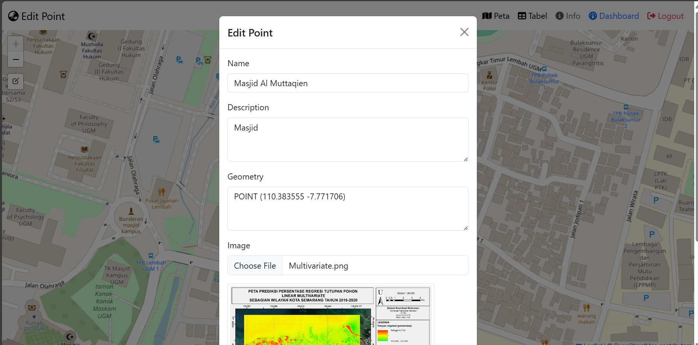
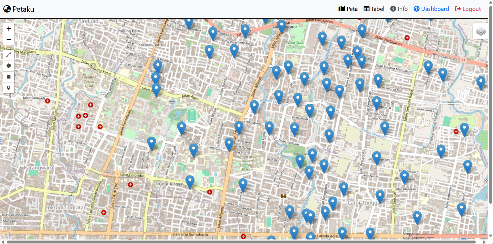
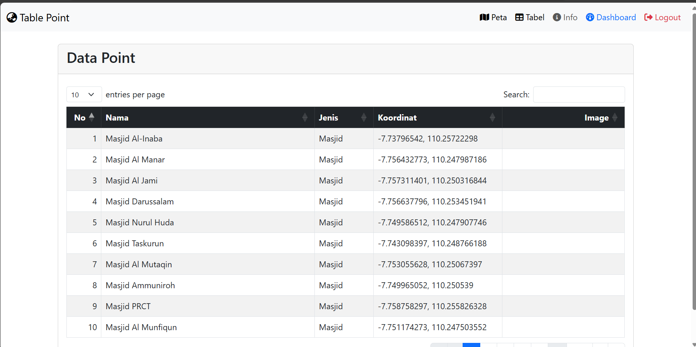
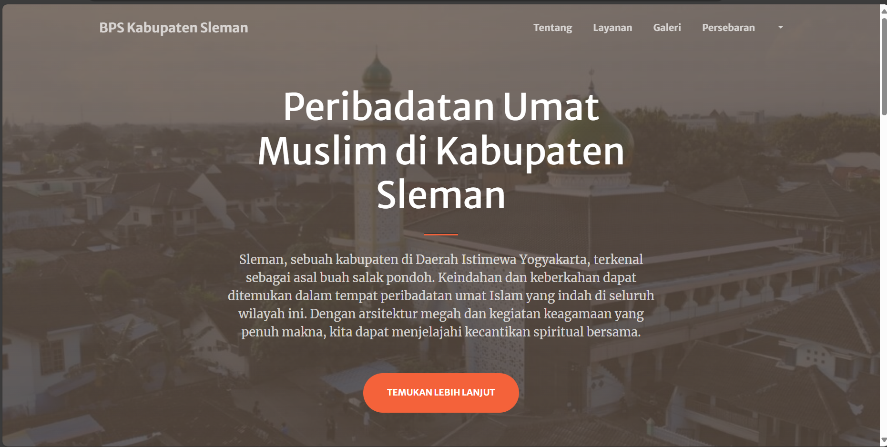
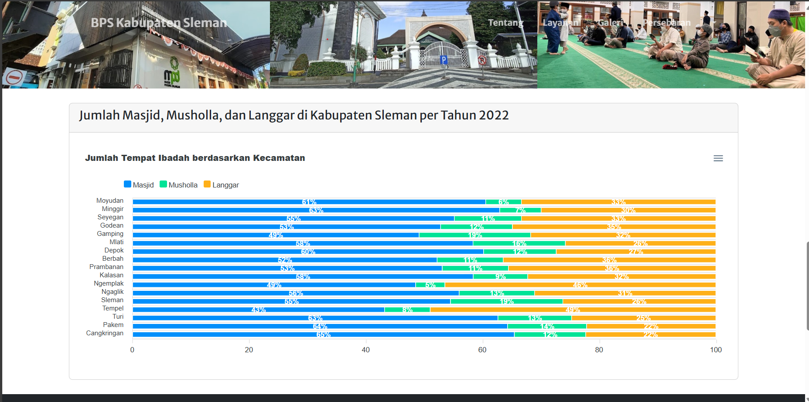

# webgis-attempt

Produk ini merupakan hasil responsi PGWEB untuk pembuatan WebGis yang membahas sesuatu di wilayah Indonesia

# **Nama Produk :**
Persebaran Titik Peribadatan Muslim di Kabupaten Sleman

# **Deskripsi Produk :**
WebGis ini merupakan sebuah web interaktif yang memberikan informasi dari persebaran titik peribadatan muslim di Kabupaten Sleman. Pengguna dapat dengan menambah dan mengedit informasi tentang masjid, surau, dan tempat ibadah lainnya di seluruh kabupaten dengan alat yang tersedia di WebGis dengan keterlibatan masyarakat dan keterlibatan kegiatan keagamaan di daerah tersebut.

# **Komponen Pembangun :**
WebGis ini dibuat berupa format php sebagai peta utama

# **Sumber Data :** 
Sumber data yang digunakan berasal dari Geoportal Kabupaten Sleman untuk titik dari persebaran titik yang SHPnya dimasukkan ke dalam Geoserver yang selanjutnya dipanggil sebagai GeoJson.

# **Tangkapan Layar Komponen Penting Produk :** 

